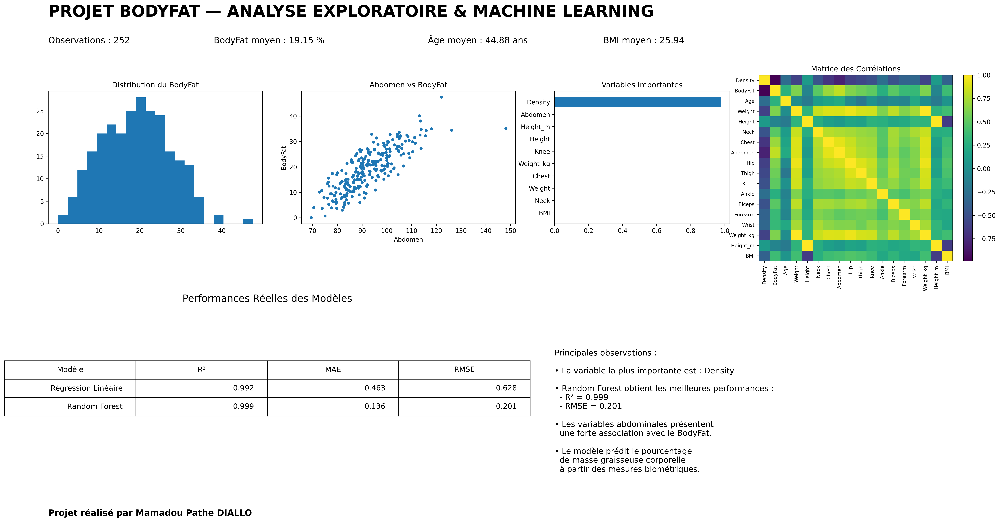

# 📊 Analyse du taux de masse graisseuse corporelle avec Machine Learning

## 📌 Description du projet

Dans le cadre de ma quête de montée en compétences en Data Analysis & Machine Learning, j’ai réalisé un projet portant sur la prédiction du taux de masse graisseuse corporelle (BodyFat) à partir de données biométriques réelles.

L’objectif du projet était :
- d’analyser les relations entre les variables biométriques ;
- d’identifier les variables les plus associées au BodyFat ;
- de comparer plusieurs modèles de Machine Learning ;
- de comprendre les performances des modèles ;
- de présenter les résultats à travers un dashboard analytique.

---

## 🧰 Technologies utilisées

- Python
- Pandas
- NumPy
- Matplotlib
- Scikit-learn
- Jupyter Notebook

---

## 📊 Analyse exploratoire des données

Les analyses ont montré que certaines variables biométriques, notamment le tour d’abdomen, présentent une forte corrélation avec le taux de masse graisseuse corporelle.

Le projet inclut :
- des analyses statistiques ;
- des visualisations ;
- une matrice de corrélation ;
- une analyse des variables importantes ;
- des comparaisons de modèles de Machine Learning.

---

## 🤖 Machine Learning

Deux modèles ont été comparés :
- Régression Linéaire
- Random Forest Regressor

Les résultats montrent que le modèle Random Forest offre les meilleures performances prédictives.

L’analyse des variables importantes montre également que la variable `Density` joue un rôle majeur dans la prédiction du BodyFat, ce qui reste cohérent avec les méthodes physiologiques utilisées pour estimer la composition corporelle.

Cette différence s’explique principalement par la capacité du Random Forest à capturer des relations non linéaires et des interactions complexes entre les variables biométriques.

---

## Performances obtenues :

- Régression Linéaire :
  - R² = 0.992
  - RMSE = 0.628

- Random Forest Regressor :
  - R² = 0.999
  - RMSE = 0.201

## 📈 Dashboard du projet

---

## 📂 Fichiers du projet

- `projet_bodyfat.ipynb` : notebook principal
- `bodyfat.csv` : dataset utilisé
- `dashboard_bodyfat_final_reel.png` : dashboard analytique

---

## 👨‍💻 Auteur

**Mamadou Pathe DIALLO**  

Data Analyst & Data Science Enthusiast
